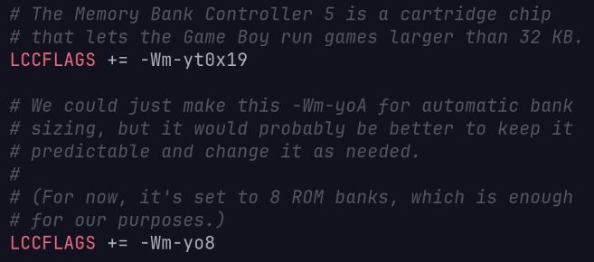

- Unfortunately, today was probably the most unproductive day we've underwent (at least, in terms of actual work done). Basically:
	- Random compilation errors totally screwed us over.
	- We had to restart from square one with our convoluted mess of a development environment.
		- Firstly, I'd like to acknowledge the fact that Windows is the most unintuitive unoperating system ever created. Even with its metric buttloads of crapware and built-in spy glasses, it cannot handle the basic accommodations every developer should have at their hand.
		- Even with Windows Subsystem for Linux (WSL), it's still barely capable of being remotely useful. The entire C toolchain (which, admittedly, is terrible on its own already) is completely out of sight on Windows natively. GUI apps installed via WSL run terribly, sometimes even failing to appear.
		- On the bright side, [NixOS-WSL](https://github.com/nix-community/NixOS-WSL) made everything significantly easier, especially since we already had a Nix flake environment set up. Literally one command and the entire toolchain we need gets installed and ready to use. *(Previously, the setup flow for Windows devices took more than ten steps. OVER TEN STEPS. JUST FOR THE DEV SHELL.)*
	- Anyway, after we had that out of the way, we were finally able to work on adding music to our game ... or so we thought. Turns out, we couldn't be more wrong.
		- MORE COMPILATION ERRORS! But this time, they wasn't so trivial.
		- As we eventually discovered during the very early stages of the development process, the GBDK docs are a total mess and half the most important information are hidden in some random corner of the website.
		- As it seemed, the music files we had in our game were so large they began to corrupt parts of the memory that we needed to store background/sprite tiles ... except they weren't even that large (a song with literally only like 5 orders couldn't fit).
			- After fighting my fingers off with the docs and AI tools trying to discover that one esoteric solution, I was almost about to give up. That was ... until I discovered [https://gbdk.org/docs/api/docs_rombanking_mbcs.html](this page), which explains ROM banking and MBCs. Apparently we needed these flags (?):
				- 
					- But that's so obscure! I thought the issue was related to hUGEDriver itself? But apparently not. The crazy thing about this is that there are essentially zero pathways on the Internet that will take you from "hUGEDriver song corrupting memory with GBDK" to "GBDK ROM banking and MBCs." Literally all the top search results are surface-level tutorials on how to get some basic sound working. *(Of course, this could just be because of my near-zero experience in C programming, but I think the docs should certainly be improved.)*
			- There are, of course, more to it than just these flags, but I won't get into those too much since they probably won't be too important after we got everything working.
	- So then, I went onto the beloved Internet again to look for some cool songs to put into our game. At the end, I ended up with two decent songs:
		- [A piano/MIDI version of Isolation by NightHawk22.](https://www.youtube.com/watch?v=P2COuITTRAk)
		- [A MIDI port of Senbonzakura (千本桜) by WhiteFlame.](https://nanomidi.net/midi/69fa389b0018042510e8)
		- We converted these MIDI files to the `.uge` format using a custom-made conversion tool in Python (will be released soon as a free and open-source CLI program).
		- Still debating on whether or not to keep these songs, especially with potential copyright-related issues, but hopefully everything works out.