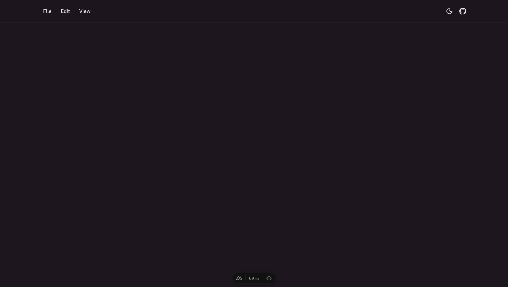

- Today was a whole lot better than yesterday, to say the least.
- We made the level background design and, along with it, the sprite tiles for all the notes! Exciting, isn't it? Here are some previews:
	- The basic tap note, where you must click the right or left arrow key depending on the direction of the indicator on the note when it's fully charged:
		- 
	- The hold note, where you must hold the up or down key depending on the direction of the arrow on the note:
		- 
	- The `A` reverse note, where you must click the `A` key when the note is fully charged.
		- 
		- This note reverses the direction of the vertical scanline.
	- The `B` reverse note, where you must click the `B` key when the note is fully charged.
		- 
		- This note also reverses the direction of the vertical scanline! It is functionally equivalent to the `A` reverse note; it is just activated with a different key.
- Also got a little head start on the actual web-based level editor interface:
	- 
	- Yep, that's it. Not much to explain. All that's there is a simple menu bar and some icons.
	- We are using [Nuxt](https://nuxt.com) for this because Nuxt places some very convenient abstractions that just makes everything so much easier (unlike, *cough cough*, C).
		- The UI toolkit we are using is called [Nuxt UI](https://ui.nuxt.com). Since our main goal is really just to have a functional level editor that doesn't look like it was made back in 2010, we decided not to write our own styles.
		- Still wondering whether or not this tech stack is too heavy for our use case, but so far it seems like it's working pretty smoothly.
	- Plans for this interface:
		- Add a timeline view at the bottom of the screen where we can scroll through the song and place notes at certain frames/ticks. Might be a little complicated (and we will definitely stumble upon some stupid issues when trying to create it), but I'm sure we'll get through it like we did with, *COUGH COUGH*, yesterday's audio corruption issue that was somehow related to ROM banking and MBCs.